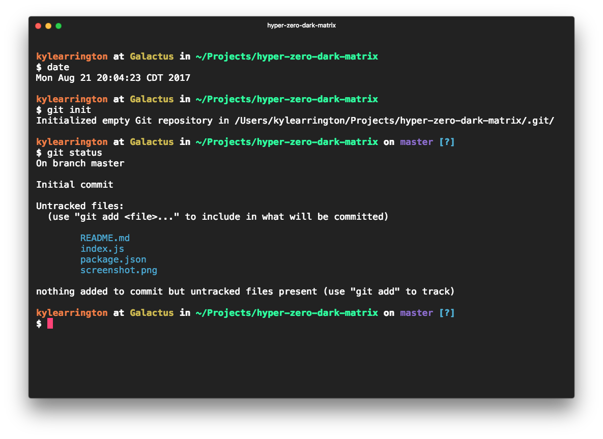

# hyperterm-rocinante

> A dark yet juicy theme for [Hyper.js](https://hyper.is)

## Install

Add `hyper-zero-dark-matrix` to the plugins list in your `~/.hyper.js` config file.

## Attribution

Palette based on the Chrome Dev tools theme Zero Dark Matrix.

## License

MIT © [Kyle Arrington](http://github.com/gig3m)
